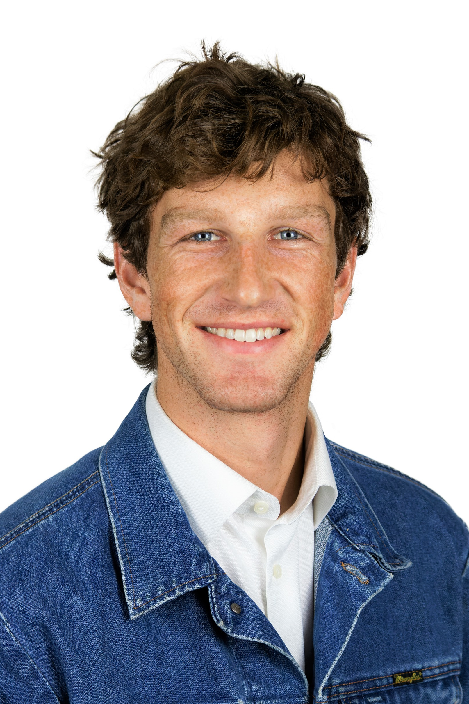

<link rel="stylesheet" href="styles.css" type="text/css">

I am a fourth year political science PhD student at UCLA focusing on American political behavior and methodology. I am concurrently pursuing a masters in statistics. 
Projects range from studying the occupational backgrounds of city council members to analyzing survey experiments focused on persuasion in parallel and COVID vaccine 
uptake. I set up and manage the UCLA national voter file. It is hosted on <a href="https://redivis.com/datasets/ey62-9t0gpyvbg">Redivis</a> where UCLA affiliated students
and professors can access it.

